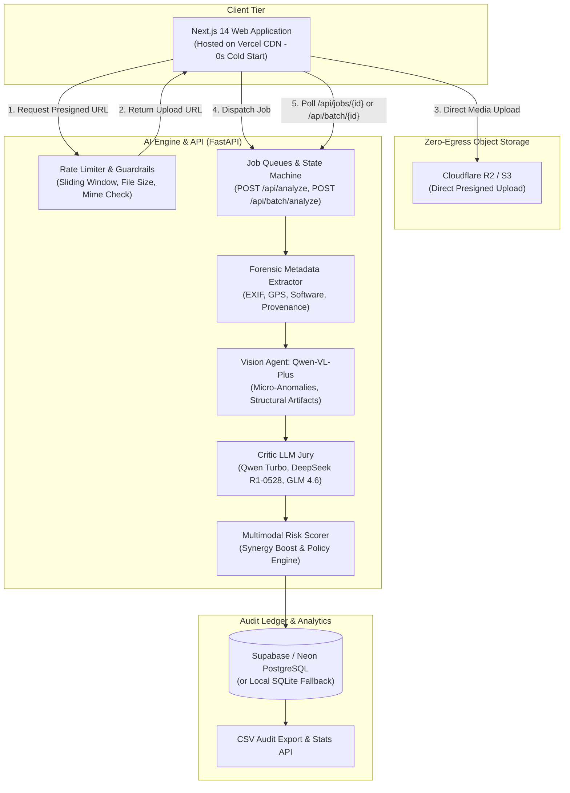

# FraudSight AI — Multi-Agent Multimodal Fraud Detection

[](https://fastapi.tiangolo.com/)
[](https://nextjs.org/)
[](https://python.org)
[](https://huggingface.co/spaces)
[](https://developers.cloudflare.com/r2/)
[](https://opensource.org/licenses/MIT)

**FraudSight AI** is a decoupled, production-grade, zero-trust insurance fraud detection platform. It cross-examines multimedia claims—including high-resolution photographs, multi-page repair PDFs, and dashcam videos—using an ensemble of multi-modal vision models and independent reasoning LLM critics.

Built to operate entirely within **100% Free-Tier Cloud Infrastructure**, FraudSight AI pairs a zero-cold-start **Next.js edge frontend** on Vercel with an asynchronous **FastAPI multi-agent brain** on Hugging Face Spaces (16GB RAM) or Render, **Cloudflare R2** zero-egress object storage, and **Supabase / Neon PostgreSQL** persistence.

---

## Architecture Overview



---

## Key Features & Capabilities

### 1. Multi-Agent Consensus Jury System
No single AI model holds unchecked authority over a claim classification.
- **Vision Specialist (`qwen/qwen-vl-plus`)**: Extracts forensic features, impossible reflections, specular inconsistencies, generative diffusion patterns, and compression anomalies.
- **Independent LLM Critics**:
  - `qwen/qwen-turbo` (OpenRouter): Logical consistency and physics cross-examination.
  - `deepseek/deepseek-r1-0528` (Featherless AI): Multi-step deep reasoning chain-of-thought analysis hosted on independent serverless infrastructure.
  - `google/gemini-2.5-pro` (OpenRouter): Document structural parsing and forensic verification.
- **Consensus Protocol**: A calibrated majority vote determines the final classification (`Real` vs `Fake`).

### 2. Multimodal Risk Scoring Engine
Rather than relying purely on binary classifications, FraudSight AI calculates an institutional-grade **Fraud Risk Score (0–100)**:
- **Visual Evidence Weight (45%)**: Anomaly confidence from the vision inspection agent.
- **Textual Evidence Weight (35%)**: Inter-critic concordance across logical jury members.
- **Forensic Metadata Weight (20%)**: Penalties for stripped EXIF, generative editing software footprints, or missing camera hardware tags.
- **Cross-Modal Synergy Boost**: Applies an automatic mathematical boost (up to +15 pts) when high visual suspicion coincides with abnormal metadata signatures.

#### Policy Recommendation Matrix
| Severity Tier | Risk Score | Policy Action | Workflow |
| :--- | :--- | :--- | :--- |
| **Critical** | 80 – 100 | `IMMEDIATE_DENIAL` | Automatically blocked from disbursement; routed to legal. |
| **High** | 60 – 79 | `SIU_INVESTIGATION` | Dispatched to Special Investigation Unit with complete forensic dossier. |
| **Medium** | 35 – 59 | `MANUAL_REVIEW` | Assigned to a senior adjuster for secondary human inspection. |
| **Low** | 0 – 34 | `FAST_TRACK_APPROVAL` | Straight-through processing for genuine claims. |

### 3. Forensic Metadata Extraction
- **EXIF Analysis**: Extracts camera make, model, lens profile, focal length, exposure time, and ISO.
- **Generative Software Detection**: Flags signatures from Photoshop, Stable Diffusion, Midjourney, Canvas, or GIMP.
- **GPS Coordinates**: Identifies geographic metadata to cross-reference incident locations.
- **PDF Forensics**: Analyzes Producer and Creator tags, modification dates, and digital signature tampering.

### 4. Sequential Zero-OOM Batch Pipeline
Batch processing on free-tier containers (e.g., Render 512MB RAM) often crashes with Exit 137 OOM errors. FraudSight AI prevents this via:
- Multi-file staging UI with individual progress tracking.
- Sequential background worker execution.
- Instant resource deallocation and file deletion in `finally:` blocks.
- Real-time polling via `GET /api/batch/{batch_id}`.

### 5. Production Guardrails
- **In-Memory Rate Limiting**: Sliding window algorithm tracking requests per IP per minute (default: 60 req/min) returning `HTTP 429 Too Many Requests`.
- **Payload Size Limits**: Rejects uploads larger than 50MB with `HTTP 413 Payload Too Large`.
- **Extension Allowlist**: Restricts files to verified media types (`jpg`, `jpeg`, `png`, `webp`, `pdf`, `mp4`, `avi`, `mov`, `mkv`, `webm`) returning `HTTP 415 Unsupported Media Type`.
- **Batch Capping**: Restricts batch uploads to safe limits (default: 10 files) with `HTTP 400 Bad Request`.

### 6. Executive Analytics Dashboard
- Live claim volume, fraud detection rates, and average processing latency.
- Risk severity tier breakdown charts.
- Paginated evaluation ledger with one-click full-fidelity CSV export for SIU investigators.

---

## API Reference

| Method | Endpoint | Description | Status Code |
| :--- | :--- | :--- | :--- |
| `GET` | `/` | Service status, active version, guardrail configs | `200 OK` |
| `GET` | `/api/health` | Health check & queue worker status (used for keepalives) | `200 OK` |
| `POST` | `/api/analyze` | Submit single media file for asynchronous analysis | `200 OK` (returns `job_id`) |
| `GET` | `/api/jobs/{job_id}` | Poll single job progress, stage, jury votes, and risk score | `200 OK` / `404` |
| `POST` | `/api/batch/analyze` | Submit multiple files for sequential zero-OOM evaluation | `200 OK` (returns `batch_id`) |
| `GET` | `/api/batch/{batch_id}`| Poll batch progress, item status, and aggregate summary | `200 OK` / `404` |
| `POST` | `/api/analyze-url` | Trigger analysis on remote media URL (Cloudflare R2 / S3) | `200 OK` |
| `POST` | `/api/storage/presigned-url` | Generate direct client PUT upload URL to Cloudflare R2 | `200 OK` |
| `GET` | `/api/storage/status` | Verify object storage configuration | `200 OK` |
| `GET` | `/api/analytics/stats` | Aggregated claim metrics, fraud rate, severity tiers | `200 OK` |
| `GET` | `/api/analytics/evaluations` | Paginated claim evaluation history | `200 OK` |
| `GET` | `/api/analytics/export-csv` | Stream full evaluation history as CSV report | `200 OK` |
| `POST` | `/analyze_media` | Synchronous evaluation endpoint for legacy compatibility | `200 OK` |

---

## 100% Free-Tier Deployment Guide

### Layer 1: Next.js Frontend on Vercel
1. Import `adimalkar/multimodal-fraud-detector` into [Vercel](https://vercel.com).
2. Set Root Directory to `frontend`.
3. Configure Environment Variable:
   - `NEXT_PUBLIC_API_URL`: Your backend URL (e.g., `https://username-multimodal-fraud-detector.hf.space`).
4. Click **Deploy**.

### Layer 2: Backend on Hugging Face Spaces (16GB RAM Free)
1. Create a new Space at [huggingface.co/spaces](https://huggingface.co/spaces).
2. Select **Docker** (Blank) and Free Hardware (2 vCPU, 16GB RAM).
3. Under **Settings → Variables and Secrets**, add:
   - `OPENROUTER_API_KEY`: Your OpenRouter API key.
   - `DATABASE_URL`: Your Supabase/Neon PostgreSQL connection string (optional).
4. Push this repository to your Space:
   ```bash
   git remote add space https://huggingface.co/spaces/YOUR_USERNAME/multimodal-fraud-detector
   git push space main
   ```
5. Hugging Face builds the included `Dockerfile` and serves the API on port 8000.

### Layer 3: Cloudflare R2 Object Storage (10GB Free, $0 Egress)
1. Create a bucket named `fraud-evidence` in the [Cloudflare Dashboard](https://dash.cloudflare.com).
2. Generate an R2 API token with Object Read & Write permissions.
3. Add `R2_ACCOUNT_ID`, `R2_ACCESS_KEY_ID`, `R2_SECRET_ACCESS_KEY`, `R2_BUCKET_NAME`, and `R2_ENDPOINT_URL` to backend environment variables.

### Layer 4: Supabase / Neon PostgreSQL (Free Tier)
1. Create a project at [supabase.com](https://supabase.com).
2. Copy the Connection URI from **Project Settings → Database**.
3. Add `DATABASE_URL` to your backend environment variables. Schema tables and indexes are initialized automatically on launch.

*(For detailed step-by-step instructions, see [DEPLOYMENT.md](DEPLOYMENT.md).)*

---

## Local Development Setup

### 1. Prerequisites
- Python 3.10+
- Node.js 18+ & npm
- `poppler-utils` (for PDF document page rendering)
  - Ubuntu/Debian: `sudo apt-get install poppler-utils`
  - macOS: `brew install poppler`

### 2. Installation
```bash
# Clone the repository
git clone https://github.com/adimalkar/multimodal-fraud-detector.git
cd multimodal-fraud-detector

# Set up Python virtual environment
python3 -m venv venv
source venv/bin/activate
pip install -r requirements.txt

# Configure environment variables
cp .env.example .env
# Edit .env and supply your OPENROUTER_API_KEY
```

### 3. Running the Stack Locally
```bash
# Terminal 1: Launch FastAPI Backend
uvicorn backend.app:app --host 0.0.0.0 --port 8000 --reload

# Terminal 2: Launch Next.js Frontend
cd frontend
cp .env.local.example .env.local
npm install
npm run dev
```

Navigate to:
- **Frontend App**: [http://localhost:3000](http://localhost:3000)
- **Interactive API Swagger Docs**: [http://localhost:8000/docs](http://localhost:8000/docs)
- **Analytics Dashboard**: [http://localhost:3000/analytics](http://localhost:3000/analytics)

---

## Automated Verification & CI/CD

This repository maintains a comprehensive automated testing pipeline in `.github/workflows/python-ci.yml`:
- **Python CI / `build-and-lint`**: Ruff linting, import hygiene, and 28 Pytest unit/integration tests.
- **Frontend CI / `Frontend Type-Check & Build`**: Next.js 14 TypeScript type-checking, ESLint, and static asset generation.
- **Container CI / `Docker & Deployment Build Check`**: Docker image containerization validation.

Run tests locally:
```bash
source venv/bin/activate
ruff check . --select=E9,F63,F7,F82
pytest tests/ -v
cd frontend && npm run type-check && npm run lint && npm run build
```

---

## License
Distributed under the MIT License. See `LICENSE` for more information.
