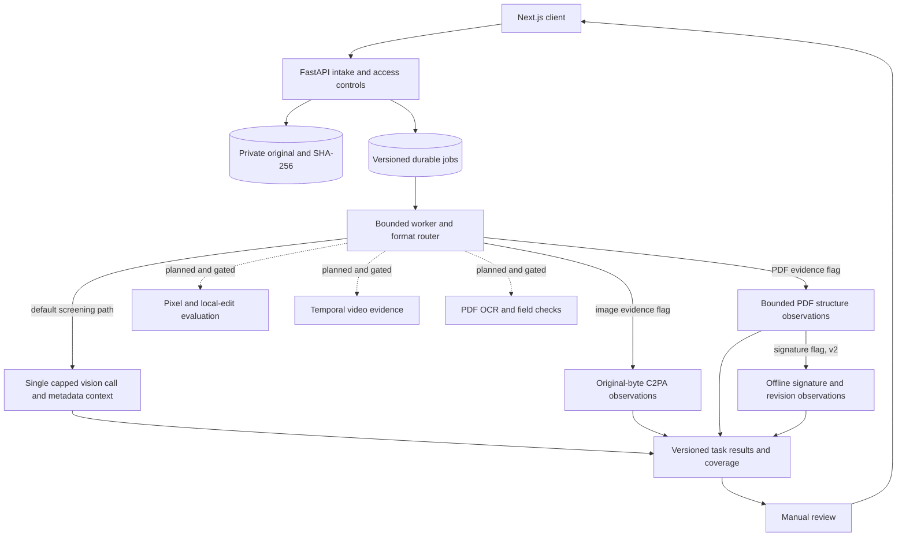

# FraudSight AI — Visual Evidence Screening

[](https://fastapi.tiangolo.com/)
[](https://nextjs.org/)
[](https://python.org)
[](https://huggingface.co/spaces)
[](https://developers.cloudflare.com/r2/)
[](https://opensource.org/licenses/MIT)

**FraudSight AI** is an in-progress visual evidence screening application for images, PDFs, and videos. The backend samples bounded visual inputs, sends one request to an OpenRouter vision model, and combines its provisional result with extracted metadata. A model verdict is not proof of AI generation or insurance fraud; every result requires human review.

The opt-in durable backend has zero-model-call image provenance and PDF structure paths. The new PDF signature path adds offline integrity and revision observations. Each path explicitly abstains on AI-generation and fraud classification; see [image evidence](docs/PHASE2_IMAGE_EVIDENCE.md), [PDF structure evidence](docs/PHASE3_PDF_EVIDENCE.md), and [PDF signature evidence](docs/PHASE3_PDF_SIGNATURE_EVIDENCE.md). These paths are not automatically active on the public site.

The repository includes a Next.js frontend, a FastAPI backend, optional object storage, and PostgreSQL or SQLite persistence. OpenRouter calls are billed even when the hosting tier is free.

---

## Architecture Overview


```mermaid
flowchart TD
    UI[Next.js client] --> API[FastAPI intake and access controls]
    API --> Original[(Private original and SHA-256)]
    API --> Jobs[(Versioned durable jobs)]
    Jobs --> Worker[Bounded worker and format router]

    Worker -->|default screening path| VLM[Single capped vision call and metadata context]
    Worker -->|image evidence flag| C2PA[Original-byte C2PA observations]
    Worker -->|PDF evidence flag| PDF1[Bounded PDF structure observations]
    PDF1 -->|signature flag, v2| PDF2[Offline signature and revision observations]

    Worker -. planned and gated .-> Image[Pixel and local-edit evaluation]
    Worker -. planned and gated .-> Video[Temporal video evidence]
    Worker -. planned and gated .-> Fields[PDF OCR and field checks]

    VLM --> Results[Versioned task results and coverage]
    C2PA --> Results
    PDF1 --> Results
    PDF2 --> Results
    Results --> Review[Manual review]
    Review --> UI
```

Solid branches are implemented paths; the durable evidence branches require their rollout flags and worker deployment. Dotted branches are planned and require independent labels, rights review, and modality-specific evaluation before a product verdict. The previous judge–critic jury is retired; [the implementation plan](docs/MULTIMODAL_DETECTION_IMPLEMENTATION_PLAN.md) defines the release gates. [technical_report.md](technical_report.md) records the original hackathon design and does not describe this rollout.

---

## Key Features & Capabilities

### 1. Bounded Visual Screening
- **Default model**: `google/gemma-4-26b-a4b-it` through OpenRouter. `OPENROUTER_VISION_MODEL` accepts only the low-cost allowlist in `backend/qwen_agent.py`.
- **One model request per item**: Up to one resized image, three rendered PDF pages, or three sampled video frames. A PDF exceeding three pages is rejected.
- **Result**: A `Real`/`Fake` screening label, visible findings, uncalibrated model confidence, reported token usage/cost when available, and `needs_review: true`. Unsampled video moments are not assessed.
- **Cost protection**: Configure a hard key spending limit and model allowlist in OpenRouter before public use. The application's in-memory IP limiter is not a billing cap.

### 2. Multimodal Risk Scoring Engine
The existing response includes a provisional 0–1 visual screening score. Metadata observations are shown as context but contribute **zero** to this score: missing EXIF, square dimensions, editing software, changed timestamps, or low frame rate do not establish AI generation or fraud. There is no independent text score or cross-modal synergy. Model confidence is not calibrated against a labeled evaluation set. `recommended_action` is always `MANUAL_REVIEW`; the application must not use this score to approve or deny claims automatically.

See [the model evaluation plan](docs/MODEL_EVALUATION_PLAN.md) for the labeled benchmark and cost gates needed before choosing a stronger model or adding a second paid call.
See [the detector architecture review](docs/DETECTOR_ARCHITECTURE_REVIEW.md) for product and open-source comparisons, the original critic-jury audit, and modality-specific next steps.
See [the multimodal implementation plan](docs/MULTIMODAL_DETECTION_IMPLEMENTATION_PLAN.md) for the phase sequence. The [durable backend rollout guide](docs/PHASE1_DURABLE_BACKEND.md) describes the opt-in PostgreSQL/R2 worker path; it is not enabled on the current Render site. The default API path still uses process-memory jobs.

### 3. Metadata Context
- **Images**: Records available EXIF camera, software, timestamp, dimensions, and GPS fields. Absence or editable tags are not proof of manipulation.
- **PDFs on the default screening path**: Reads a limited sample of Creator, Producer, and date tags; this path does not validate PDF signatures or document contents. The opt-in PDF v2 path checks signatures separately.
- **Video**: Records dimensions, frame rate, and duration. Low frame rate alone does not imply AI generation.
- **Scoring**: These unverified observations contribute zero to the current single-model screening score.

### 4. Sequential Zero-OOM Batch Pipeline
Batch processing on free-tier containers (e.g., Render 512MB RAM) often crashes with Exit 137 OOM errors. FraudSight AI prevents this via:
- Multi-file staging UI with individual progress tracking.
- Sequential background worker execution.
- Instant resource deallocation and file deletion in `finally:` blocks.
- Real-time polling via `GET /api/batch/{batch_id}`.

### 5. Production Guardrails
- **In-Memory Rate Limiting**: Sliding window algorithm tracking requests per IP per minute (default: 60 req/min) returning `HTTP 429 Too Many Requests`.
- **Payload Size Limits**: Rejects uploads larger than 50MB with `HTTP 413 Payload Too Large`.
- **Extension Allowlist**: Restricts files to verified media types (`jpg`, `jpeg`, `png`, `webp`, `pdf`, `mp4`, `avi`, `mov`, `mkv`, `webm`) returning `HTTP 415 Unsupported Media Type`.
- **Batch Capping**: Restricts batch uploads to safe limits (default: 10 files) with `HTTP 400 Bad Request`.

### 6. Executive Analytics Dashboard
- Live claim volume, fraud detection rates, and average processing latency.
- Risk severity tier breakdown charts.
- Paginated evaluation ledger with one-click full-fidelity CSV export for SIU investigators.

---

## API Reference

| Method | Endpoint | Description | Status Code |
| :--- | :--- | :--- | :--- |
| `GET` | `/` | Service status, active version, guardrail configs | `200 OK` |
| `GET` | `/api/health` | Health check & queue worker status (used for keepalives) | `200 OK` |
| `GET` | `/api/ready` | Confirms the OpenRouter key is present and accepted | `200 OK` / `503` |
| `POST` | `/api/analyze` | Submit single media file for asynchronous analysis | `200 OK` (returns `job_id`) |
| `GET` | `/api/jobs/{job_id}` | Poll job progress, model attribution, and provisional score | `200 OK` / `404` |
| `POST` | `/api/batch/analyze` | Submit multiple files for sequential zero-OOM evaluation | `200 OK` (returns `batch_id`) |
| `GET` | `/api/batch/{batch_id}`| Poll batch progress, item status, and aggregate summary | `200 OK` / `404` |
| `POST` | `/api/analyze-url` | Trigger analysis on remote media URL (Cloudflare R2 / S3) | `200 OK` |
| `POST` | `/api/storage/presigned-url` | Generate direct client PUT upload URL to Cloudflare R2 | `200 OK` |
| `GET` | `/api/storage/status` | Verify object storage configuration | `200 OK` |
| `GET` | `/api/analytics/stats` | Aggregated claim metrics, fraud rate, severity tiers | `200 OK` |
| `GET` | `/api/analytics/evaluations` | Paginated claim evaluation history | `200 OK` |
| `GET` | `/api/analytics/export-csv` | Stream full evaluation history as CSV report | `200 OK` |
| `POST` | `/analyze_media` | Synchronous evaluation endpoint for legacy compatibility | `200 OK` |

Analysis submission endpoints return `503 MODEL_PROVIDERS_UNCONFIGURED` before creating a job when required model credentials are absent, or `503 MODEL_PROVIDERS_UNAVAILABLE` when a provider rejects or cannot verify its key. A batch whose every item fails has status `failed`; partial batches retain successful results and report failed items individually. `/api/health` reports liveness and whether keys are configured; `/api/ready` checks provider authentication through non-billable account endpoints and caches the outcome for one minute. It does not guarantee model availability or accuracy.

---

## Deployment Guide

### Layer 1: Next.js Frontend on Vercel
1. Import `adimalkar/multimodal-fraud-detector` into [Vercel](https://vercel.com).
2. Set Root Directory to `frontend`.
3. Configure Environment Variable:
   - `NEXT_PUBLIC_API_URL`: Your backend URL (e.g., `https://username-multimodal-fraud-detector.hf.space`).
4. Click **Deploy**.

### Layer 2: Backend on Hugging Face Spaces (16GB RAM Free)
1. Create a new Space at [huggingface.co/spaces](https://huggingface.co/spaces).
2. Select **Docker** (Blank) and Free Hardware (2 vCPU, 16GB RAM).
3. Under **Settings → Variables and Secrets**, add:
   - `OPENROUTER_API_KEY`: Your OpenRouter API key.
   - `DATABASE_URL`: Your Supabase/Neon PostgreSQL connection string (optional).
4. Push this repository to your Space:
   ```bash
   git remote add space https://huggingface.co/spaces/YOUR_USERNAME/multimodal-fraud-detector
   git push space main
   ```
5. Hugging Face builds the included `Dockerfile` and serves the API on port 8000.

### Layer 3: Cloudflare R2 Object Storage (10GB Free, $0 Egress)
1. Create a bucket named `fraud-evidence` in the [Cloudflare Dashboard](https://dash.cloudflare.com).
2. Generate an R2 API token with Object Read & Write permissions.
3. Add `R2_ACCOUNT_ID`, `R2_ACCESS_KEY_ID`, `R2_SECRET_ACCESS_KEY`, `R2_BUCKET_NAME`, and `R2_ENDPOINT_URL` to backend environment variables.

### Layer 4: Supabase / Neon PostgreSQL (Free Tier)
1. Create a project at [supabase.com](https://supabase.com).
2. Copy the Connection URI from **Project Settings → Database**.
3. Add `DATABASE_URL` to your backend environment variables. Schema tables and indexes are initialized automatically on launch.

*(For detailed step-by-step instructions, see [DEPLOYMENT.md](DEPLOYMENT.md).)*

---

## Local Development Setup

### 1. Prerequisites
- Python 3.10+
- Node.js 18+ & npm
- `poppler-utils` (for PDF document page rendering)
  - Ubuntu/Debian: `sudo apt-get install poppler-utils`
  - macOS: `brew install poppler`

### 2. Installation
```bash
# Clone the repository
git clone https://github.com/adimalkar/multimodal-fraud-detector.git
cd multimodal-fraud-detector

# Set up Python virtual environment
python3 -m venv venv
source venv/bin/activate
pip install -r requirements.txt

# Configure environment variables
cp .env.example .env
# Edit .env and supply OPENROUTER_API_KEY
```

### 3. Running the Stack Locally
```bash
# Terminal 1: Launch FastAPI Backend
uvicorn backend.app:app --host 0.0.0.0 --port 8000 --reload

# Terminal 2: Launch Next.js Frontend
cd frontend
cp .env.local.example .env.local
npm install
npm run dev
```

Navigate to:
- **Frontend App**: [http://localhost:3000](http://localhost:3000)
- **Interactive API Swagger Docs**: [http://localhost:8000/docs](http://localhost:8000/docs)
- **Analytics Dashboard**: [http://localhost:3000/analytics](http://localhost:3000/analytics)

Verify the backend response before connecting the frontend or deploying it:
```bash
python scripts/check_backend.py http://localhost:8000 --allow-unconfigured
# Omit --allow-unconfigured on a deployment that should accept real analysis jobs.
```
The check validates JSON response bodies and the OpenAPI route list, so a different app returning `200` HTML does not pass.

Run `python scripts/check_media_pipeline.py --preprocess-only` to verify local image, PDF, and video decoding. Once `/api/ready` succeeds, run `python scripts/check_media_pipeline.py http://localhost:8000` for provider-backed jobs in all three formats. This uses synthetic evidence, calls the configured model providers, and checks that each job returns a structured result; it does not measure detection accuracy.

---

## Automated Verification & CI/CD

This repository maintains a comprehensive automated testing pipeline in `.github/workflows/python-ci.yml`:
- **Python CI / `build-and-lint`**: Ruff linting, import hygiene, and 28 Pytest unit/integration tests.
- **Frontend CI / `Frontend Type-Check & Build`**: Next.js 14 TypeScript type-checking, ESLint, and static asset generation.
- **Container CI / `Docker & Deployment Build Check`**: Docker image containerization validation.

Run tests locally:
```bash
source venv/bin/activate
ruff check . --select=E9,F63,F7,F82
pytest tests/ -v
cd frontend && npm run type-check && npm run lint && npm run build
```

---

## License
Distributed under the MIT License. See `LICENSE` for more information.
